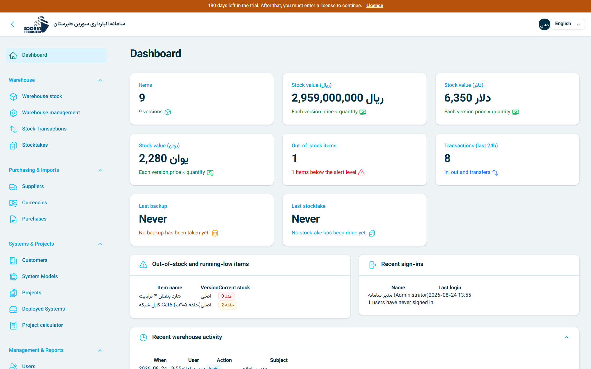
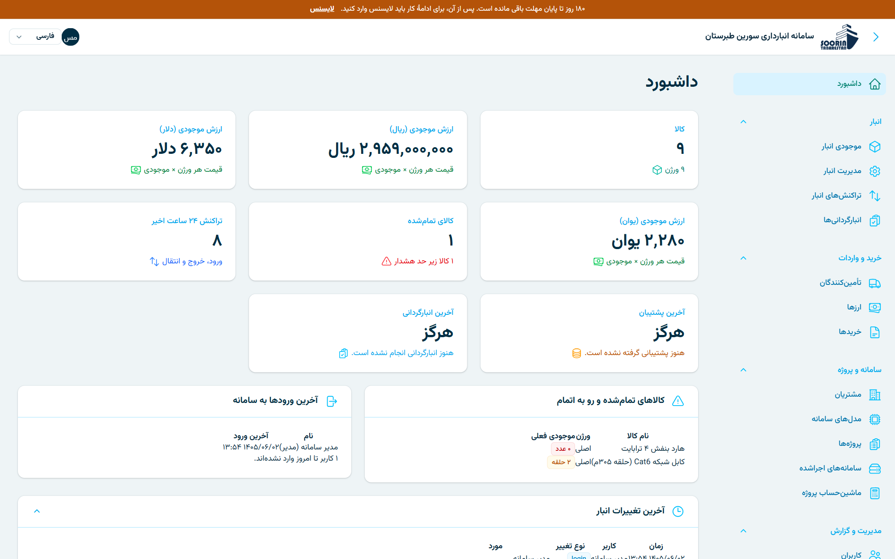
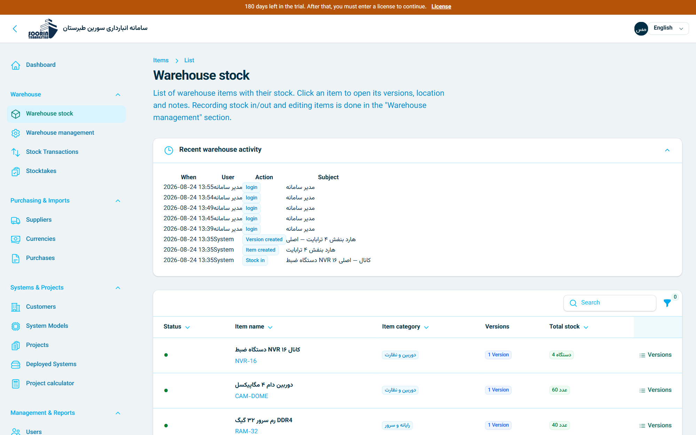
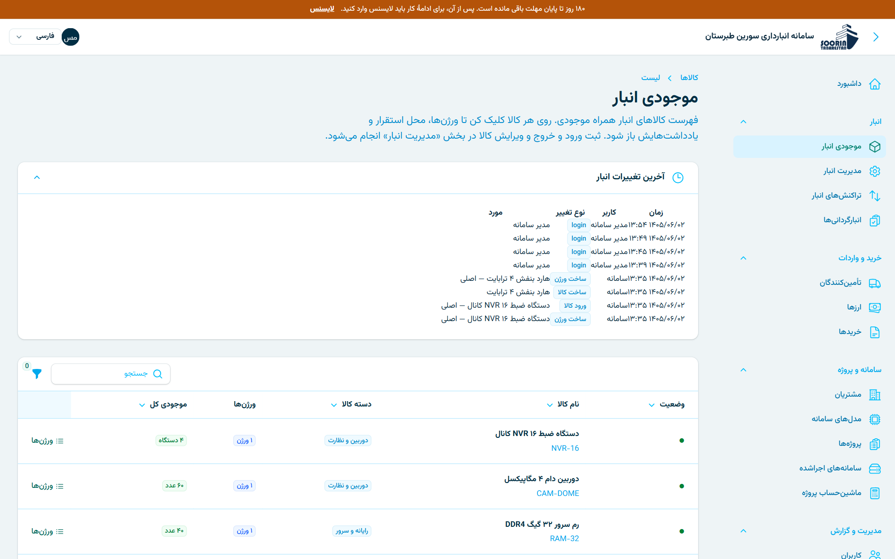
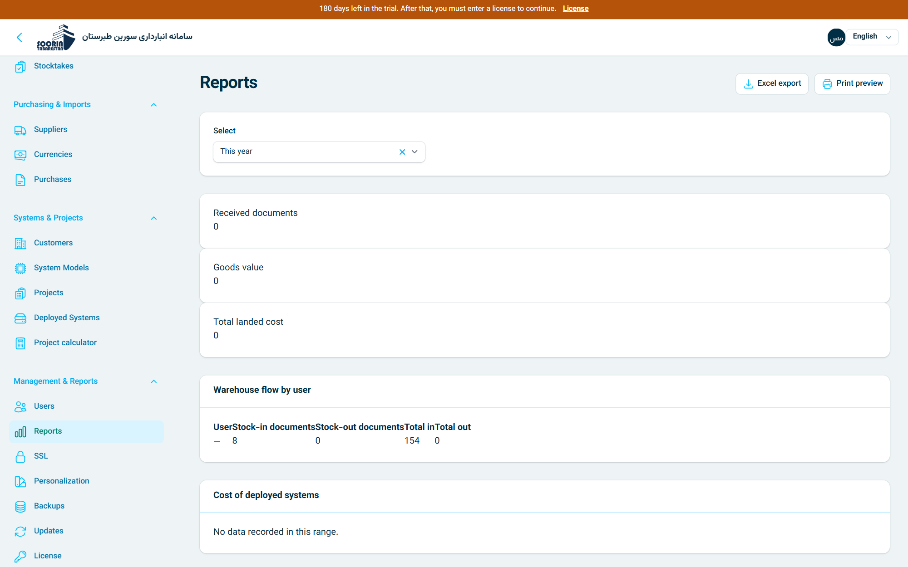
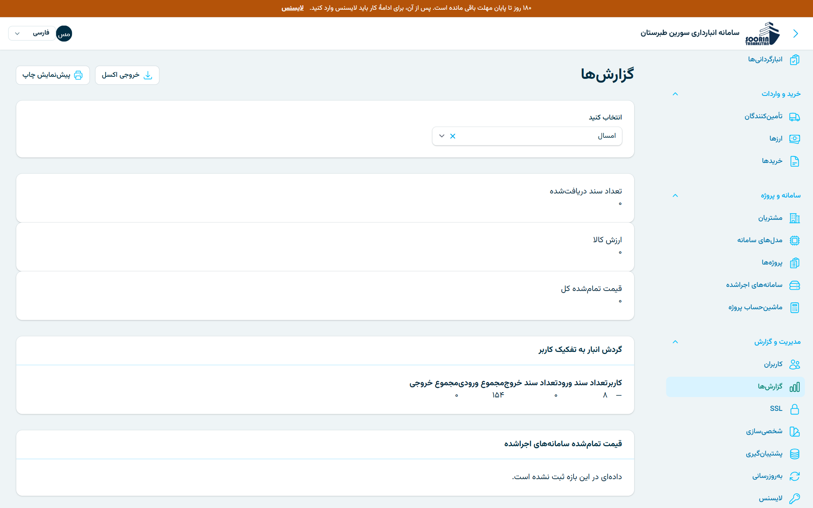
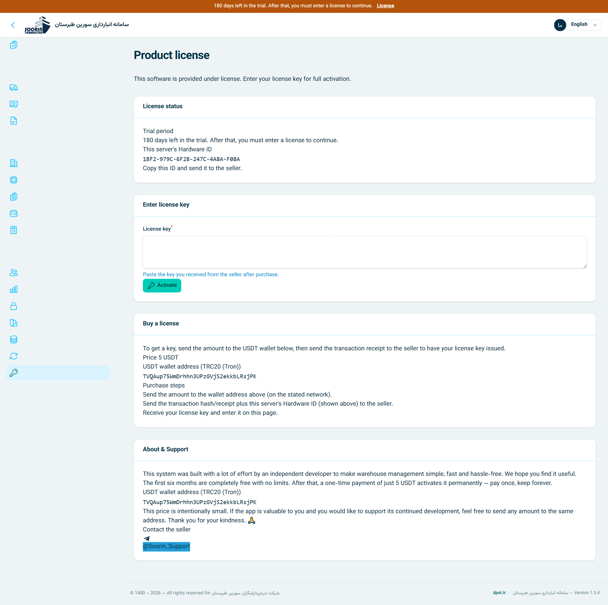
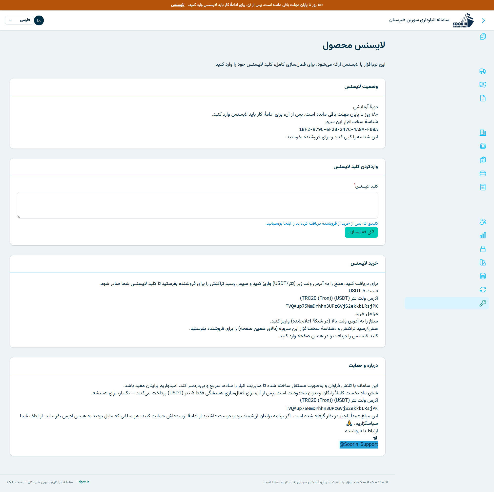
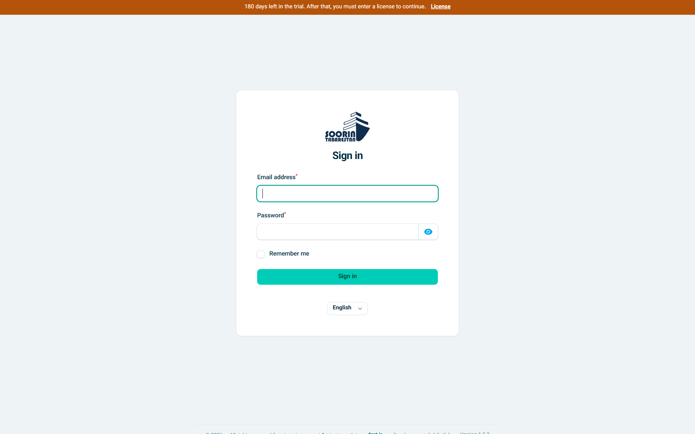
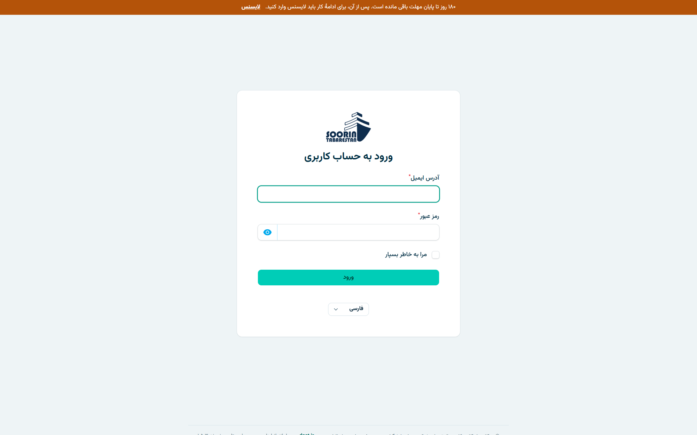

# Soorin Inventory — Warehouse & Project Management System

<p>
  
  
  
  
  
  <a href="https://github.com/soorintec/Soorin_Inventory/stargazers"></a>
</p>

**A modern, self-hosted inventory and warehouse management system** for small and
mid-size businesses. Multi-warehouse stock, purchasing & currency imports, FIFO
landed cost, Bill of Materials (BOM), projects, and deployed-system tracking — in
one clean, fast panel.

> 🎁 **6 months free, full features.** After that, a **one-time 5 USDT** activates it
> forever. No subscription, no cloud lock-in — it runs on **your own server**.

> 🤖 **Built with the help of AI.** This project is actively improved based on your
> feedback — please [open an issue](https://github.com/soorintec/Soorin_Inventory/issues)
> with ideas, bugs, or feature requests. **And if you find Soorin useful, please give it a ⭐ star** — it truly helps and lets others discover it.
>
> 🤖 **این پروژه با کمکِ هوش مصنوعی ساخته شده.** برای بهبودِ برنامه خوشحال می‌شوم
> [فیدبک بدهید](https://github.com/soorintec/Soorin_Inventory/issues) (ایده، باگ یا درخواستِ قابلیت). و اگر راضی بودید، لطفاً به پروژه ⭐ **استار** بدهید — خیلی کمک می‌کند.



---

## ✨ Features

- **Multi-warehouse stock** — main, consignment (at customer), returns/defective, in-transit.
- **Items → versions → stock** — price and stock live on the version; serial-number tracking for high-value items.
- **Purchasing & imports** — foreign-currency purchase docs, extra costs (shipping/customs/insurance) allocated to landed cost.
- **FIFO costing** — cost of goods frozen at consumption time from real lots.
- **BOM & project calculator** — define what a system is built from; calculate parts, cost and shortages across multiple systems.
- **Stocktake** — blind counting sheet, discrepancy report, one-click stock update.
- **Reports & printing** — print-preview reports, Excel/PDF export.
- **Dashboard** — stock value per currency, low-stock alerts, recent activity.
- **Currencies** — add any currency (IRR/USD/CNY/…), wired into pricing everywhere.
- **Customers, projects & deployed systems** — track installed systems and their parts at each customer.
- **Roles & granular permissions** — per-user checkboxes; revoke any capability, even from an admin.
- **Backups** — one-click database backup & restore, from the panel.
- **Excel import** — import your existing stock from an Excel file with one command.
- **8 languages, RTL & LTR** — Persian, English, Arabic, Russian, Chinese, German, French, Italian. Jalali or Gregorian calendar per language.
- **White-label** — change business name, logo, colors and contact info from the panel.
- **1-click updates** — update from GitHub or an uploaded zip, with automatic pre-update backup.
- **Free HTTPS** — issue Let's Encrypt (public) or self-signed (LAN) certificates from the panel.

## 🌍 Languages

فارسی · English · العربية · Русский · 中文 · Deutsch · Français · Italiano
(Adding a new language takes minutes — see [`docs/TRANSLATIONS.md`](docs/TRANSLATIONS.md).)

## 🧰 Tech stack

Laravel 12 · Filament 4 · PHP 8.3+ · MySQL/MariaDB · self-hosted.

---

## 🚀 Quick start (try the free trial)

**Debian server (recommended, one command):**

```bash
git clone https://github.com/soorintec/Soorin_Inventory.git /var/www/soorin-inventory
cd /var/www/soorin-inventory
sudo bash deploy/debian-setup.sh
```

Then open `http://YOUR-SERVER/admin`. Full guide: **[docs/DEBIAN-INSTALL.md](docs/DEBIAN-INSTALL.md)**.

**Any host (WordPress-style web installer):** upload the files and open the site — a
setup wizard asks for your database and admin account. See **[docs/INSTALL.md](docs/INSTALL.md)**.

**Local (development):**

```bash
composer install
cp .env.example .env
php artisan key:generate
php artisan migrate --seed
php artisan serve --port=8001
```

Panel: <http://127.0.0.1:8001/admin> — demo login `admin@yoursite.com` / `password`
(seeded data only, for development).

## 💳 Pricing & license

- **First 6 months: free, no limits.**
- **After that: one-time 5 USDT** — activates permanently on that server.
- **Pay (USDT · TRC20):** `TVQAup75WmDrhhn3UPzGVjS2ekkbLRsjPK`
- **Then contact us on Telegram** with your transaction hash + server Hardware ID (shown on the in-app License page) to receive your key: **[t.me/Soorin_Support](https://t.me/Soorin_Support)**

Details: [docs/LICENSING.md](docs/LICENSING.md).

## 📸 Screenshots

| English (LTR) | فارسی (RTL) |
| --- | --- |
|  |  |
|  |  |
|  |  |
|  |  |
|  |  |

## 📚 Documentation

- [Debian install](docs/DEBIAN-INSTALL.md) · [General install](docs/INSTALL.md)
- [Licensing / selling](docs/LICENSING.md) · [Translations](docs/TRANSLATIONS.md)
- [License / EULA](LICENSE.md) · [Changelog](CHANGELOG.md)

## 🧪 Tests

```bash
php artisan test
```

---

<div dir="rtl">

## فارسی — سامانه انبار و مدیریت پروژه

سامانهٔ مدرن و **خودمیزبان (self-hosted)** انبارداری و مدیریت پروژه: چند انبار،
خرید و واردات ارزی، قیمت تمام‌شدهٔ FIFO، مدل سامانه و BOM، پروژه و سامانه‌های
نصب‌شده نزد مشتری — همه در یک پنل تمیز و سریع.

**۶ ماه رایگان و کامل؛ پس از آن فقط یک‌بار ۵ تتر (USDT) برای فعال‌سازی همیشگی.**
بدون اشتراک ماهانه، روی سرور خودتان.

- **قیمت:** ۵ تتر (USDT) — پرداخت یک‌باره و همیشگی
- **آدرس ولت (USDT · TRC20):** `TVQAup75WmDrhhn3UPzGVjS2ekkbLRsjPK`
- **پس از پرداخت**، هش تراکنش + «شناسهٔ سخت‌افزارِ سرور» (در صفحهٔ لایسنسِ برنامه) را در تلگرام بفرست تا کلید صادر شود: **[t.me/Soorin_Support](https://t.me/Soorin_Support)**

### همهٔ قابلیت‌ها

- **چند انبار** — مرکزی، امانی نزد مشتری، مرجوعی/معیوب، در راه
- **کالا ← ورژن ← موجودی** — قیمت و موجودی روی ورژن؛ ثبت شماره سریال برای اقلام گران
- **خرید و واردات** — اسناد خرید ارزی، سرشکن‌کردن هزینه‌های جانبی (حمل/گمرک/بیمه) در قیمت تمام‌شده
- **قیمت تمام‌شدهٔ FIFO** — بهای تمام‌شده در لحظهٔ مصرف از لات‌های واقعی منجمد می‌شود
- **BOM و ماشین‌حساب پروژه** — تعریف قطعات هر سامانه؛ محاسبهٔ قطعات، هزینه و کسری برای چند سامانه با هم
- **انبارگردانی** — فهرست شمارش بدون عدد، گزارش مغایرت، به‌روزرسانی موجودی با یک کلیک
- **گزارش و چاپ** — پیش‌نمایش چاپ، خروجی اکسل و PDF
- **داشبورد** — ارزش موجودی به تفکیک ارز، هشدار کسری، آخرین فعالیت‌ها
- **مدیریت ارزها** — هر واحد پول دلخواه (ریال/دلار/یوان/…)، متصل به قیمت‌گذاری
- **نقش‌ها و دسترسی تیک‌خور** — به‌ازای هر کاربر؛ هر دسترسی حتی از مدیر قابل گرفتن است
- **مشتریان، پروژه‌ها و سامانه‌های اجراشده** — ردیابی سامانه‌های نصب‌شده و قطعاتشان نزد مشتری
- **پشتیبان‌گیری** — تهیه و بازیابی دیتابیس با یک کلیک از پنل
- **۸ زبان، راست‌به‌چپ و چپ‌به‌راست** — فارسی، انگلیسی، عربی، روسی، چینی، آلمانی، فرانسوی، ایتالیایی؛ تقویم شمسی یا میلادی و ارقام محلی
- **سفارشی‌سازی (White-label)** — تغییر نام کسب‌وکار، لوگو و اطلاعات تماس از پنل
- **به‌روزرسانی یک‌کلیکی** — از گیت‌هاب یا فایل زیپ، با پشتیبان‌گیری خودکار پیش از آپدیت
- **HTTPS رایگان** — صدور گواهی Let's Encrypt (عمومی) یا self-signed (شبکهٔ داخلی) از پنل
- **ورود اکسل** — وارد کردن موجودی از فایل اکسل با یک دستور

راهنمای نصب: [نصب روی دبیان](docs/DEBIAN-INSTALL.md) · [راهنمای عمومی](docs/INSTALL.md)

</div>
